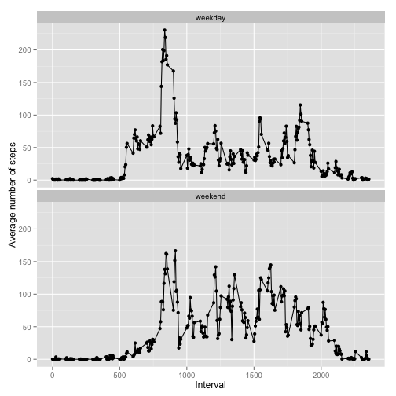

## Loading and preprocessing the data

The data is a CSV file with 3 columns. NAs are indicated by "NA", and there is a header row.


```r
library(ggplot2)
activityData <- read.csv("activity.csv",header=T,na.strings="NA")
```

The date column is converted to a date type.


```r
activityData$date <- as.Date(activityData$date)
```

Finally, sort by date and interval (the data are already sorted, but just in case).

```r
activityData <- activityData[order(activityData$date,activityData$interval),]
```

## What is mean total number of steps taken per day?
First we remove any NAs from the data set

```r
activityDataNoNA <- na.omit(activityData)
```

The aggregate function is used to get the sum per day. A histogram is created using ggplot2.

```r
stepsPerDay <- aggregate(steps ~ date, data=activityDataNoNA, sum)
histBinWidth <- diff(range(stepsPerDay$steps))/40
qplot(stepsPerDay$steps,binwidth=histBinWidth) + xlab("Steps")
```

 

Finally, calculate the mean and median number of steps per day.

```r
meanSteps <- mean(stepsPerDay$steps)
medianSteps <- median(stepsPerDay$steps)
```
The mean number of steps is 10766.19 and the median number of steps is 10765.

## What is the average daily activity pattern?
To determine the average daily activity pattern, the number of steps is averaged across all days for each time interval. Again, the assumption is still that NAs are ignored.

```r
avgStepsPerInt <- aggregate(steps ~ interval, data=activityDataNoNA, mean)
```

Next create the time series plot.


```r
ggplot(data=avgStepsPerInt, aes(x=interval, y=steps)) + geom_point() + geom_line() + xlab("Interval") + ylab("Average number of steps")
```

 

Determine the interval with the maximum average number of steps.


```r
intervalMax <- avgStepsPerInt$interval[avgStepsPerInt$steps == max(avgStepsPerInt$steps)]
```

The 5-minute interval with the maximum number of steps, on average across all the days in the dataset, is interval 835.

## Imputing missing values

```r
numNA <- sum(is.na(activityData$steps))
```

There are 2304 rows with NA steps.

Since the NAs may introduce a bias into some of the data analysis, the NAs will be replaced with the mean for the time interval. To accomplish this, the steps column from the data frame with the time interval means (avgStepsPerInt) is replicated by the number of days (repMean). Once this is done, imputting missing data is just a matter of indexing into repMean with the indexes of the NAs in the original dataset. Note that this assumes that the dataset is sorted by the date then the interval, which I ensure by explicitly sorting the dataset in the preprocessing step.


```r
numDays <- length(unique(activityData$date))
# Since the activityData data frame is already sorted, I can do the following
repMean <- rep(avgStepsPerInt$steps,numDays)

# Wherever we have an NA in the steps column, just replace it with the corresponding row of repMean
imputedActivityData <- activityData
imputedActivityData$steps[is.na(imputedActivityData$steps)] <- repMean[is.na(imputedActivityData$steps)]
```

Now create a histogram of the total number of steps per day and the new mean and median for the imputed data set.

```r
impStepsPerDay <- aggregate(steps ~ date, data=imputedActivityData, sum)
qplot(impStepsPerDay$steps, binwidth=histBinWidth) + xlab("Steps")
```

 

```r
meanImpSteps <- mean(stepsPerDay$steps)
medianImpSteps <- median(stepsPerDay$steps)
```

The number of mean steps per day was 10766.19 and the median was 10765.

There is no difference from the estimates in the earlier part of the assignment where the NAs were omitted. Imputting missing data does increase the total daily number of steps however.

## Are there differences in activity patterns between weekdays and weekends?

Create a new factor variable indicating if the date is a weekend.

```r
weekdayVector <- weekdays(imputedActivityData$date)
weekendLogical <- weekdayVector == "Sunday" | weekdayVector == "Saturday"
imputedActivityData$weekend <- factor(weekendLogical, levels=c(FALSE,TRUE),labels=c("weekday","weekend"))
```

Make a panel plot of the 5-minute interval and the average number of steps taken, averaged across all weekday days or weekend days.


```r
# Aggregate by interval and weekend
dayAvgStepsPerInt <- aggregate(steps ~ interval + weekend, data = imputedActivityData,mean)
# make a panel plot with ggplot2
ggplot(data=dayAvgStepsPerInt, aes(x=interval, y=steps)) + geom_point() + geom_line() + facet_wrap(~weekend,ncol=1) + xlab("Interval") + ylab("Average number of steps")
```

 
